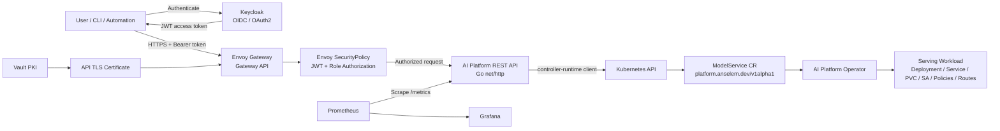

# AI Platform REST API — Overview and Architecture

## 1. Purpose

This document is the architectural overview for the AI Platform REST API implemented in the `ai-platform-operator` repository.

It preserves the major design decisions, request flow, security model, Kubernetes integration, HTTPS exposure, observability, SLI/SLO model, alerting, testing strategy, and current phase status so the work can be understood and reproduced without relying on terminal history.

> **Current status:** the REST API implementation itself is complete. The remaining work for the phase is documentation consolidation, including recovery/troubleshooting and the complete command reference.

---

## 2. Why the REST API Exists

The platform already exposes the Kubernetes custom resource:

```yaml
apiVersion: platform.anselem.dev/v1alpha1
kind: ModelService
```

The REST API provides a controlled platform-facing interface in front of Kubernetes so users and automation do not need direct Kubernetes credentials or `kubectl` access to manage `ModelService` resources.

Without the API:

```text
User / automation
        |
        v
kubectl / Kubernetes API
        |
        v
ModelService
```

With the API:

```text
User / automation
        |
        | HTTPS + JWT
        v
AI Platform REST API
        |
        | Kubernetes client
        v
ModelService
        |
        v
AI Platform Operator
        |
        v
Serving workload and dependent resources
```

The REST API does **not** replace the operator. The API manages desired state; the operator remains responsible for reconciliation and lifecycle management.

---

## 3. High-Level Architecture



External request path:

```text
Client
  |
  | HTTPS
  | Authorization: Bearer <JWT>
  v
Envoy Gateway
  |
  | HTTPRoute
  | Envoy SecurityPolicy
  | JWT / role enforcement
  v
AI Platform REST API
  |
  | Request ID
  | authentication
  | authorization
  | validation
  | audit logging
  | metrics
  v
controller-runtime Kubernetes client
  |
  v
Kubernetes API
  |
  v
ModelService CR
  |
  v
AI Platform Operator
```

---

## 4. Repository Structure

Main API source:

```text
cmd/platform-api/main.go

internal/api/
├── auth/
├── config/
├── handlers/
├── kubernetes/
├── logging/
├── metrics/
├── middleware/
├── request/
├── response/
├── validation/
├── routes.go
└── server.go
```

Deployment and platform integration are under:

```text
config/platform-api/
```

Important resources in this area include:

- API Deployment
- API Service
- ServiceAccount
- Role
- RoleBinding
- OIDC CA ConfigMap
- HTTPRoute resources
- Envoy SecurityPolicy
- NetworkPolicy
- ServiceMonitor
- PrometheusRule
- Kustomize configuration

Container build:

```text
Dockerfile.platform-api
```

Monitoring assets:

```text
infrastructure/monitoring/
├── kube-prometheus-stack-values.yaml
├── grafana-dashboard-platform-api.yaml
└── rule-tests/
    ├── ai-platform-api.rules.yaml
    └── ai-platform-api.test.yaml
```

Keycloak helper scripts used during API validation:

```text
infrastructure/keycloak/scripts/pkce-login.py
infrastructure/keycloak/scripts/get-machine-token.sh
```

CRUD E2E validation:

```text
infrastructure/platform-api/scripts/validate-api-crud-workflow.sh
```

---

## 5. API Technology

The API is implemented in Go.

Core choices:

```text
HTTP server        Go net/http
routing            http.ServeMux
Kubernetes client  controller-runtime client
OIDC/JWT           github.com/coreos/go-oidc
metrics            github.com/prometheus/client_golang
logging            log/slog
```

This keeps the API small and explicit while reusing the same Kubernetes client ecosystem as the operator.

---

## 6. API Contract

API prefix:

```text
/api/v1
```

ModelService base path:

```text
/api/v1/model-services
```

Implemented endpoints:

| Method | Path | Purpose |
|---|---|---|
| `GET` | `/healthz` | Liveness |
| `GET` | `/readyz` | Readiness |
| `GET` | `/metrics` | Prometheus metrics |
| `GET` | `/api/v1/model-services` | List ModelServices |
| `GET` | `/api/v1/model-services/{name}` | Get a ModelService |
| `GET` | `/api/v1/model-services/{name}/status` | Get ModelService status |
| `POST` | `/api/v1/model-services` | Create ModelService |
| `PUT` | `/api/v1/model-services/{name}` | Update/replace ModelService |
| `PATCH` | `/api/v1/model-services/{name}` | Partially update ModelService |
| `DELETE` | `/api/v1/model-services/{name}` | Delete ModelService |

External API hostname:

```text
https://api.ai-platform.local
```

---

## 7. Authentication

Authentication is provided by Keycloak using OpenID Connect.

Realm:

```text
ai-platform
```

Issuer:

```text
https://auth.ai-platform.local/realms/ai-platform
```

Expected audience:

```text
ai-platform-gateway
```

Internal JWKS endpoint:

```text
http://keycloak.keycloak.svc.cluster.local:8080/realms/ai-platform/protocol/openid-connect/certs
```

The API validates the expected OIDC/JWT trust properties, including:

- signature
- issuer
- audience
- token expiry
- authenticated subject
- role claims

The API does not trust identity data supplied directly by the caller.

---

## 8. Keycloak Clients

### `ai-platform-gateway`

Purpose:

```text
Protected resource / API audience
```

### `ai-platform-cli`

Purpose:

```text
Interactive user access
```

Flow:

```text
Authorization Code + PKCE S256
```

Direct password grant is not used.

### `ai-platform-service`

Purpose:

```text
Machine-to-machine access
```

Machine-token helper:

```bash
infrastructure/keycloak/scripts/get-machine-token.sh
```

Token output:

```text
.local/keycloak/tokens/service-access-token.jwt
```

Interactive PKCE helper:

```bash
infrastructure/keycloak/scripts/pkce-login.py
```

Callback:

```text
127.0.0.1:18080
```

---

## 9. Authorization Model

Logical platform roles:

```text
platform-viewer
platform-deployer
platform-admin
```

Effective permissions:

| Operation | Viewer | Deployer | Admin |
|---|---:|---:|---:|
| List ModelServices | Yes | Yes | Yes |
| Get ModelService | Yes | Yes | Yes |
| Get ModelService status | Yes | Yes | Yes |
| Create ModelService | No | Yes | Yes |
| Update ModelService | No | Yes | Yes |
| Patch ModelService | No | Yes | Yes |
| Delete ModelService | No | No | Yes |

Deletion is intentionally more restrictive than the other mutation operations.

Authorization is layered:

```text
JWT
 |
 v
Envoy SecurityPolicy
 |
 v
API authentication
 |
 v
API role authorization
 |
 v
Kubernetes ServiceAccount RBAC
```

This provides defense in depth.

---

## 10. Middleware and Request Flow

Outer middleware:

```text
RequestID
  ->
RequestLogging
  ->
RequestMetrics
  ->
ServeMux
```

Protected API flow:

```text
Authentication
  ->
AuditLogging
  ->
Protected router
  ->
RequireAnyRole
  ->
Handler
```

This ordering allows:

- every request to carry a request ID
- request logs to record final status
- metrics to observe final status and latency
- audit logging to see authenticated identity
- audit logging to observe authorization outcomes
- handlers to execute only after required authorization succeeds

Request correlation header:

```text
X-Request-ID
```

---

## 11. Kubernetes Integration

The API manages:

```yaml
apiVersion: platform.anselem.dev/v1alpha1
kind: ModelService
```

Lifecycle:

```text
REST API
   |
   | create / update / patch / delete
   v
ModelService
   |
   v
AI Platform Operator
   |
   | reconciliation
   v
Dependent resources
```

The operator remains authoritative for reconciling desired and observed state.

---

## 12. Namespace Restriction

The API is restricted to:

```text
ai-platform
```

Clients cannot select arbitrary Kubernetes namespaces.

This prevents the API from becoming a generic Kubernetes proxy and simplifies authorization, RBAC, audit analysis, policy enforcement, and operational ownership.

---

## 13. Kubernetes ServiceAccount and RBAC

The API runs as:

```text
ServiceAccount: ai-platform-api
```

The ServiceAccount receives only the Kubernetes permissions required by the API.

Effective security model:

```text
application authorization
        +
Kubernetes RBAC
```

The API is not given unrestricted cluster-admin access.

---

## 14. Health and Readiness

Liveness:

```text
GET /healthz
```

Readiness:

```text
GET /readyz
```

They are used by Kubernetes probes and are intentionally excluded from customer-facing SLI calculations so probe traffic does not distort availability, error ratio, request rate, or latency signals.

---

## 15. Container Image

Container build:

```text
Dockerfile.platform-api
```

Builder:

```text
golang:1.26
```

Runtime:

```text
distroless static:nonroot
```

Runtime identity:

```text
UID 65532
GID 65532
```

Development image:

```text
ai-platform-api:dev
```

Development cluster image policy:

```text
imagePullPolicy: Never
```

Typical workflow:

```bash
docker build \
  -f Dockerfile.platform-api \
  -t ai-platform-api:dev .

kind load docker-image \
  ai-platform-api:dev \
  --name ai-platform-policy

kubectl rollout restart \
  deployment/ai-platform-api \
  -n ai-platform

kubectl rollout status \
  deployment/ai-platform-api \
  -n ai-platform \
  --timeout=180s
```

---

## 16. Runtime Hardening

Pod-level controls:

```text
runAsNonRoot: true
runAsUser: 65532
runAsGroup: 65532
seccompProfile: RuntimeDefault
```

Container-level controls:

```text
allowPrivilegeEscalation: false
capabilities:
  drop:
    - ALL
readOnlyRootFilesystem: true
```

The ServiceAccount token remains mounted because the API requires authenticated access to the Kubernetes API.

---

## 17. Envoy Gateway and HTTPS

External traffic is served through:

```text
gateway-system/shared-gateway
```

Lab external address:

```text
172.19.255.200
```

Flow:

```text
Client
   |
   | HTTPS :443
   v
Envoy Gateway
   |
   | HTTPRoute
   | SecurityPolicy
   v
ai-platform-api Service
   |
   v
API pod :8080
```

The API Service remains internal; external clients do not connect directly to the pod.

HTTP-to-HTTPS redirect is configured as a separate route.

---

## 18. Vault PKI and API TLS

API hostname:

```text
api.ai-platform.local
```

Certificate:

```text
api-ai-platform-local
```

TLS secret:

```text
api-ai-platform-local-tls
```

Namespace:

```text
gateway-system
```

The certificate is issued through the platform Vault PKI integration.

The local validation CA file used by CLI tests is:

```text
.local/keycloak/fraud-model-root-ca.crt
```

---

## 19. Envoy SecurityPolicy

The external API route is protected by Envoy SecurityPolicy.

The edge validates JWTs and applies role-based authorization before forwarding traffic to the Go API.

The application still performs its own authentication and authorization.

This intentionally creates two enforcement points:

```text
edge authorization
       +
application authorization
```

Operational consequence:

```text
request denied by Envoy
    ->
never reaches Go API
    ->
no application audit event
```

This was observed during DELETE validation with a non-admin machine/deployer identity: Envoy returned `403` before the API processed the request.

---

## 20. NetworkPolicy

The API is protected by Kubernetes NetworkPolicy.

Ingress allows only the required callers, including:

- Envoy proxy traffic to TCP `8080`
- Prometheus scraping to TCP `8080`

Prometheus is selected from the `monitoring` namespace using labels including:

```text
app.kubernetes.io/name=prometheus
operator.prometheus.io/name=kps-kube-prometheus-stack-prometheus
```

A direct access test from an arbitrary pod was denied with a connection timeout while Prometheus scraping remained functional.

Egress is restricted to required dependencies such as:

- DNS
- Kubernetes API
- the Envoy/identity-provider path required for OIDC discovery

During hardening, an initially restrictive policy prevented OIDC discovery because the CNI observed post-DNAT traffic. The policy was corrected using namespace/pod selectors for the Envoy proxy target path.

This is an important operational lesson: NetworkPolicy must match the packet path actually seen by the CNI, not only the logical external address.

---

## 21. Structured Logging

The API uses Go `slog` with structured JSON output.

Operational logs use fields such as:

- request ID
- HTTP method
- route/path context
- HTTP status
- request outcome

The goal is machine-readable, correlatable operational evidence rather than unstructured console messages.

---

## 22. Mutation Audit Logging

Mutation methods are audited:

```text
POST
PUT
PATCH
DELETE
```

GET requests are not emitted as mutation audit events.

Audit fields include:

```text
event=api_audit
request_id
method
route
resource_type
resource_name
status
outcome
subject
username
roles
```

Resource type:

```text
ModelService
```

Possible outcomes include:

```text
success
unauthorized
denied
rejected
error
```

JWT access tokens are never logged.

Successful POST validation produced an event with:

```text
event=api_audit
method=POST
route=/api/v1/model-services
status=201
outcome=success
username=service-account-ai-platform-service
```

Successful admin DELETE validation produced:

```text
event=api_audit
method=DELETE
route=/api/v1/model-services/{name}
resource_name=audit-probe
status=204
outcome=success
username=admin-user
```

The deleted resource was then verified as absent from Kubernetes.

For POST, `resource_name` may be empty because the audit middleware intentionally does not reread the already-consumed request body.

---

## 23. Prometheus Metrics

The API exposes:

```text
GET /metrics
```

Main collectors:

```text
ai_platform_api_http_requests_total
ai_platform_api_http_request_duration_seconds
ai_platform_api_http_requests_in_flight
```

Request counter labels:

```text
method
route
status
```

Latency histogram labels:

```text
method
route
status
```

The `/metrics` path is excluded from the request-metrics middleware to avoid self-observation noise.

---

## 24. Low-Cardinality Route Labels

Dynamic model names are normalized before being used as metric labels.

Examples:

```text
/api/v1/model-services
/api/v1/model-services/{name}
/api/v1/model-services/{name}/status
/healthz
/readyz
/metrics
unmatched
```

The API does **not** use user names, resource names, request IDs, or JWT values as Prometheus labels.

This prevents high-cardinality metric growth.

---

## 25. ServiceMonitor

ServiceMonitor:

```text
config/platform-api/servicemonitor.yaml
```

Important settings:

```text
namespace: ai-platform
port: http
path: /metrics
scheme: http
interval: 30s
scrapeTimeout: 10s
```

Service selection:

```text
app.kubernetes.io/name=ai-platform-api
```

Prometheus target discovery was validated successfully.

Healthy target:

```text
up{job="ai-platform-api",namespace="ai-platform"} = 1
```

---

## 26. Grafana Dashboard

Dashboard:

```text
AI Platform API Overview
```

UID:

```text
ai-platform-api-overview
```

Provisioned from:

```text
infrastructure/monitoring/grafana-dashboard-platform-api.yaml
```

Panels:

1. API Target
2. API Requests/sec
3. 5xx Error Rate
4. API p95 Latency
5. Requests In Flight
6. Request Rate by Route
7. Request Rate by Status
8. p95 Latency by Route

The target panel uses absent-safe semantics so a missing target can be represented as DOWN rather than silently disappearing.

Request/latency panels preserve genuine `No data` states instead of inventing artificial values.

---

## 27. Prometheus Alert Rules

Rules are defined in:

```text
config/platform-api/prometheusrule.yaml
```

The final validated suite contains:

```text
17 rules
```

Matching Prometheus version used for validation:

```text
Prometheus / promtool 3.13.2
```

Cluster image:

```text
quay.io/prometheus/prometheus:v3.13.2-distroless
```

Main alerts:

```text
AIPlatformAPIDown
AIPlatformAPIHigh5xxRate
AIPlatformAPIHighP95Latency
AIPlatformAPIErrorBudgetFastBurn
AIPlatformAPIErrorBudgetSlowBurn
```

Healthy live rules were verified with:

```text
health = ok
lastError = null
```

---

## 28. API Availability Alert

`AIPlatformAPIDown` detects both a discovered target returning `up == 0` and a completely absent target.

The expression preserves operational labels with:

```promql
max by (job, namespace) (
  up{
    job="ai-platform-api",
    namespace="ai-platform"
  }
) == 0
```

combined with:

```promql
absent(
  up{
    job="ai-platform-api",
    namespace="ai-platform"
  }
)
```

Settings:

```text
for: 2m
severity: critical
```

Live behavior was validated through healthy, pending, and recovery states; deterministic firing behavior is covered by `promtool`.

---

## 29. 5xx Alert

Alert:

```text
AIPlatformAPIHigh5xxRate
```

Threshold:

```text
5xx ratio > 5%
```

Duration:

```text
for: 5m
```

Health and readiness routes are excluded.

The numerator safely handles a missing 5xx series without turning a missing denominator into a false signal.

---

## 30. Latency Alert

Alert:

```text
AIPlatformAPIHighP95Latency
```

Threshold:

```text
p95 > 500 ms
```

Duration:

```text
for: 5m
```

The p95 is calculated from:

```text
ai_platform_api_http_request_duration_seconds_bucket
```

using `histogram_quantile`.

Synthetic histogram data validates the firing behavior.

---

## 31. SLI Recording Rules

Implemented recording rules include:

```text
ai_platform_api:sli_availability_ratio:5m
ai_platform_api:sli_error_ratio:5m
ai_platform_api:sli_p95_latency_seconds:5m
ai_platform_api:sli_request_rate:5m

ai_platform_api:sli_availability_ratio:1h
ai_platform_api:sli_availability_ratio:24h

ai_platform_api:slo_availability_error_budget_consumed_ratio:24h

ai_platform_api:sli_error_ratio:1h
ai_platform_api:sli_error_ratio:6h

ai_platform_api:slo_error_budget_burn_rate:5m
ai_platform_api:slo_error_budget_burn_rate:1h
ai_platform_api:slo_error_budget_burn_rate:6h
```

They are loaded under:

```text
ai-platform-api.sli
```

and were observed with:

```text
type = recording
health = ok
```

---

## 32. Availability SLI Semantics

Availability is request-based.

Current interpretation:

```text
5xx     -> unsuccessful service request
non-5xx -> available service response
```

This deliberately means responses such as `401`, `403`, and `404` are not counted as service availability failures.

Examples:

```text
401 -> missing/invalid caller authentication
403 -> authorization decision
404 -> valid lookup result for absent resource
5xx -> server/service failure
```

Health/readiness probe traffic is excluded.

---

## 33. Availability SLO

Engineering objective:

```text
99.9% availability
```

Allowed error ratio:

```text
1 - 0.999 = 0.001
```

or:

```text
0.1%
```

This is an internal engineering objective for the platform lab, not a contractual SLA.

Healthy runtime validation produced:

```text
availability:1h  = 1
availability:24h = 1
error budget consumed:24h = 0
```

---

## 34. Error-Budget Burn Rate

Burn rate:

```text
observed error ratio
--------------------
allowed error ratio
```

For a 99.9% SLO:

```text
allowed error ratio = 0.001
```

Examples:

```text
0.001 / 0.001 = 1x
0.010 / 0.001 = 10x
0.020 / 0.001 = 20x
```

A burn rate greater than `1` means the error budget is being consumed faster than the sustainable rate.

---

## 35. Fast-Burn Alert

Alert:

```text
AIPlatformAPIErrorBudgetFastBurn
```

Conditions:

```text
5m burn rate > 14.4
AND
1h burn rate > 14.4
```

Duration:

```text
for: 2m
```

Severity:

```text
critical
```

The live rule was verified as:

```text
state = inactive
health = ok
lastError = null
```

under healthy conditions.

---

## 36. Slow-Burn Alert

Alert:

```text
AIPlatformAPIErrorBudgetSlowBurn
```

Conditions:

```text
1h burn rate > 6
AND
6h burn rate > 6
```

Duration:

```text
for: 15m
```

Severity:

```text
warning
```

The live rule was verified as:

```text
state = inactive
health = ok
lastError = null
```

under healthy conditions.

---

## 37. Prometheus Rule Testing

Rule test files:

```text
infrastructure/monitoring/rule-tests/ai-platform-api.rules.yaml
infrastructure/monitoring/rule-tests/ai-platform-api.test.yaml
```

Syntax check:

```bash
docker run --rm \
  -v "$PWD/infrastructure/monitoring/rule-tests:/rules:ro" \
  --entrypoint /bin/promtool \
  "${PROM_IMAGE}" \
  check rules \
  /rules/ai-platform-api.rules.yaml
```

Final result:

```text
SUCCESS: 17 rules found
```

Rule tests:

```bash
docker run --rm \
  -v "$PWD/infrastructure/monitoring/rule-tests:/rules:ro" \
  -w /rules \
  --entrypoint /bin/promtool \
  "${PROM_IMAGE}" \
  test rules \
  ai-platform-api.test.yaml
```

Final result:

```text
SUCCESS
```

Synthetic coverage includes:

- API-down firing
- high 5xx ratio
- high p95 latency
- SLI error-ratio recording
- fast burn
- slow burn

---

## 38. Functional and End-to-End Testing

The API has unit/integration coverage around core functionality, including areas such as:

- routing
- authentication
- authorization
- Kubernetes store/client behavior
- metrics middleware
- audit middleware
- request handling
- operator/security edge cases

Automated CRUD E2E validation:

```text
infrastructure/platform-api/scripts/validate-api-crud-workflow.sh
```

Observed result:

```text
PASS 20/20
```

---

## 39. Security Validation Summary

Validated layers include:

### Application authorization

Viewer/deployer/admin behavior was exercised.

### Envoy authorization

Insufficient-role requests were rejected at the edge where configured.

### Kubernetes RBAC

The API ServiceAccount is least privilege rather than cluster-admin.

### NetworkPolicy

An arbitrary pod was blocked from directly accessing the API while Envoy and Prometheus retained required access.

### Runtime security

The API runs with:

```text
non-root UID/GID
allowPrivilegeEscalation=false
drop ALL capabilities
readOnlyRootFilesystem=true
RuntimeDefault seccomp
```

### Sensitive data

JWT access tokens are not emitted into logs or metric labels.

---

## 40. Important Operational Distinction: Edge vs API Rejection

The architecture has two authorization enforcement points.

A request rejected by Envoy:

```text
Client -> Envoy -> 401/403
```

never reaches the API.

Therefore:

- no Go handler runs
- no API mutation audit event exists
- API-side metrics may not see the request

A request that reaches the API and is rejected there:

```text
Client -> Envoy -> API -> 401/403
```

can be observed by the API middleware.

Troubleshooting must therefore consider both Envoy and application evidence.

---

## 41. Important Operational Distinction: No Traffic vs Failure

Request-based SLIs may legitimately have no value when there has been no recent customer traffic.

After an API pod restart:

```text
process-local counters reset
```

and health/readiness requests are excluded from customer SLIs.

Therefore:

```text
No data
```

does not automatically mean:

```text
API down
```

Target health and request-based SLIs are intentionally separate signals.

The implementation avoids forcing every missing SLI to zero because:

```text
no traffic != 0% availability
no traffic != 100% availability
```

---

## 42. Prometheus Integration Detail

The monitoring stack uses `kube-prometheus-stack` in:

```text
monitoring
```

Release:

```text
kps
```

The `PrometheusRule` must include:

```yaml
release: kps
```

because the Prometheus resource selects rule objects using that label.

This was discovered during rule-loading validation.

Live rule groups:

```text
ai-platform-api.sli
ai-platform-api.slo
ai-platform-api.availability
ai-platform-api.errors
ai-platform-api.latency
```

---

## 43. Grafana Provisioning

Grafana dashboards are provisioned through ConfigMaps discovered by the Grafana sidecar.

The sidecar watches for:

```text
grafana_dashboard=1
```

The API dashboard is therefore stored declaratively in Git rather than existing only as UI state.

Prometheus datasource UID:

```text
prometheus
```

---

## 44. Example Machine API Request

Obtain token:

```bash
infrastructure/keycloak/scripts/get-machine-token.sh
```

Load it:

```bash
TOKEN="$(
  cat .local/keycloak/tokens/service-access-token.jwt
)"
```

Call the API:

```bash
curl \
  --cacert .local/keycloak/fraud-model-root-ca.crt \
  -sS \
  -H "Authorization: Bearer ${TOKEN}" \
  https://api.ai-platform.local/api/v1/model-services
```

Clear token variable:

```bash
unset TOKEN
```

---

## 45. Example Interactive Admin Authentication

Run:

```bash
infrastructure/keycloak/scripts/pkce-login.py
```

Then load:

```bash
ADMIN_TOKEN="$(
  cat .local/keycloak/tokens/user-access-token.jwt
)"
```

The admin identity can perform operations including DELETE, subject to both edge and application authorization policy.

---

## 46. End-to-End Control-Plane Flow

Authenticated read:

```text
1. Client authenticates with Keycloak.
2. Keycloak issues a JWT access token.
3. Client connects to https://api.ai-platform.local.
4. Envoy terminates TLS.
5. Envoy SecurityPolicy validates token/policy.
6. Envoy forwards allowed traffic to the API Service.
7. API assigns or propagates X-Request-ID.
8. Request logging and metrics begin.
9. API authentication validates identity.
10. API authorization validates required role.
11. Handler executes.
12. Kubernetes client reads ModelService.
13. API returns response.
14. Metrics record route, method, status, and latency.
15. Structured request log is emitted.
```

Mutation:

```text
1-10. Same security/request pipeline.
11. Mutation handler validates request.
12. Kubernetes client creates/updates/patches/deletes ModelService.
13. Mutation audit event is emitted.
14. Operator observes desired-state change.
15. Operator reconciles dependent workload resources.
16. ModelService status reflects observed state.
```

---

## 47. Key Design Principles

### REST API as a platform boundary

The API exposes a constrained `ModelService` contract rather than becoming a generic Kubernetes proxy.

### Operator remains lifecycle authority

The API writes desired state; the operator reconciles it.

### Defense in depth

```text
TLS
+
Envoy JWT/role policy
+
API JWT validation
+
API role authorization
+
namespace restriction
+
Kubernetes RBAC
+
NetworkPolicy
+
runtime hardening
```

### Low-cardinality observability

Metric labels use bounded route templates and status/method values.

### Auditable mutations

Mutating operations create structured audit events without exposing tokens.

### Request-based SLOs

Customer request outcomes, not health probes, drive the availability SLI.

### Deterministic alert testing

Prometheus alert logic is tested with `promtool`, not only with destructive live experiments.

---

## 48. REST API Phase Checklist

```text
[✓] API architecture defined
[✓] API contract and endpoints defined
[✓] Go API project structure created
[✓] Health and readiness endpoints added
[✓] Configuration loading added
[✓] Structured logging added
[✓] Kubernetes client added
[✓] Least-privilege API ServiceAccount and RBAC added
[✓] List ModelServices endpoint added
[✓] Get ModelService endpoint added
[✓] Get ModelService status endpoint added
[✓] Keycloak JWT validation added
[✓] API role-based authorization added
[✓] Create ModelService endpoint added
[✓] Update ModelService endpoint added
[✓] Patch ModelService endpoint added
[✓] Delete ModelService endpoint added
[✓] Request validation and error handling added
[✓] Namespace restrictions added
[✓] Container image and Kubernetes manifests added
[✓] API exposed through Envoy Gateway HTTPS
[✓] Envoy SecurityPolicy attached to API route
[✓] NetworkPolicy and Pod security added
[✓] Audit logging and Prometheus metrics added
[✓] Unit and integration tests added
[✓] End-to-end API workflow validated
[✓] Manifests and scripts stored in Git
[~] Recovery and troubleshooting documented
[~] REST API documentation set completed
[ ] AI Platform REST API phase complete
```

The technical implementation is complete. The phase becomes fully complete after the documentation set, recovery/troubleshooting guide, and command reference are committed.

---

## 49. Planned REST API Documentation Set

```text
docs/rest-api/
├── 00-overview-and-architecture.md
├── 01-api-contract-and-project-structure.md
├── 02-configuration-and-startup.md
├── 03-kubernetes-client-and-rbac.md
├── 04-read-endpoints.md
├── 05-authentication-and-authorization.md
├── 06-create-update-patch-delete.md
├── 07-validation-errors-and-namespace-restrictions.md
├── 08-container-and-kubernetes-deployment.md
├── 09-envoy-gateway-and-https.md
├── 10-networkpolicy-and-runtime-hardening.md
├── 11-audit-logging-and-prometheus-metrics.md
├── 12-grafana-alerting-and-slo.md
├── 13-testing-and-end-to-end-validation.md
├── 14-recovery-and-troubleshooting.md
├── 15-complete-command-reference.md
└── README.md
```

This file is the authoritative architecture entry point for that documentation set.

---

## 50. Final Architecture Summary

```text
                         ┌────────────────────┐
                         │      Keycloak      │
                         │ OIDC / OAuth2 / JWT│
                         └─────────┬──────────┘
                                   │
                              JWT access token
                                   │
                                   v
┌──────────────┐           ┌────────────────────┐
│ User / CLI / │  HTTPS    │   Envoy Gateway    │
│ Automation   ├──────────>│ + SecurityPolicy   │
└──────────────┘           └─────────┬──────────┘
                                     │
                                     v
                           ┌──────────────────────┐
                           │ AI Platform REST API │
                           │                      │
                           │ Request ID           │
                           │ Authentication       │
                           │ Authorization        │
                           │ Validation           │
                           │ Audit logging        │
                           │ Prometheus metrics   │
                           └──────────┬───────────┘
                                      │
                              controller-runtime
                                      │
                                      v
                           ┌──────────────────────┐
                           │    Kubernetes API    │
                           └──────────┬───────────┘
                                      │
                                      v
                           ┌──────────────────────┐
                           │    ModelService CR   │
                           └──────────┬───────────┘
                                      │
                               watched/reconciled
                                      │
                                      v
                           ┌──────────────────────┐
                           │ AI Platform Operator │
                           └──────────┬───────────┘
                                      │
                                      v
                           ┌──────────────────────┐
                           │ Serving Workload /   │
                           │ Networking / Policy  │
                           └──────────────────────┘
```

Observability:

```text
AI Platform REST API
        |
        | /metrics
        v
ServiceMonitor
        |
        v
Prometheus
   |         |
   |         +--> Alert rules
   |               +--> availability
   |               +--> 5xx
   |               +--> p95 latency
   |               +--> fast burn
   |               +--> slow burn
   |
   +--> Recording rules
   |       +--> availability SLI
   |       +--> error ratio
   |       +--> p95 latency
   |       +--> request rate
   |       +--> error-budget consumption
   |       +--> burn rates
   |
   v
Grafana
```

This architecture completes the technical definition of the AI Platform REST API phase.
